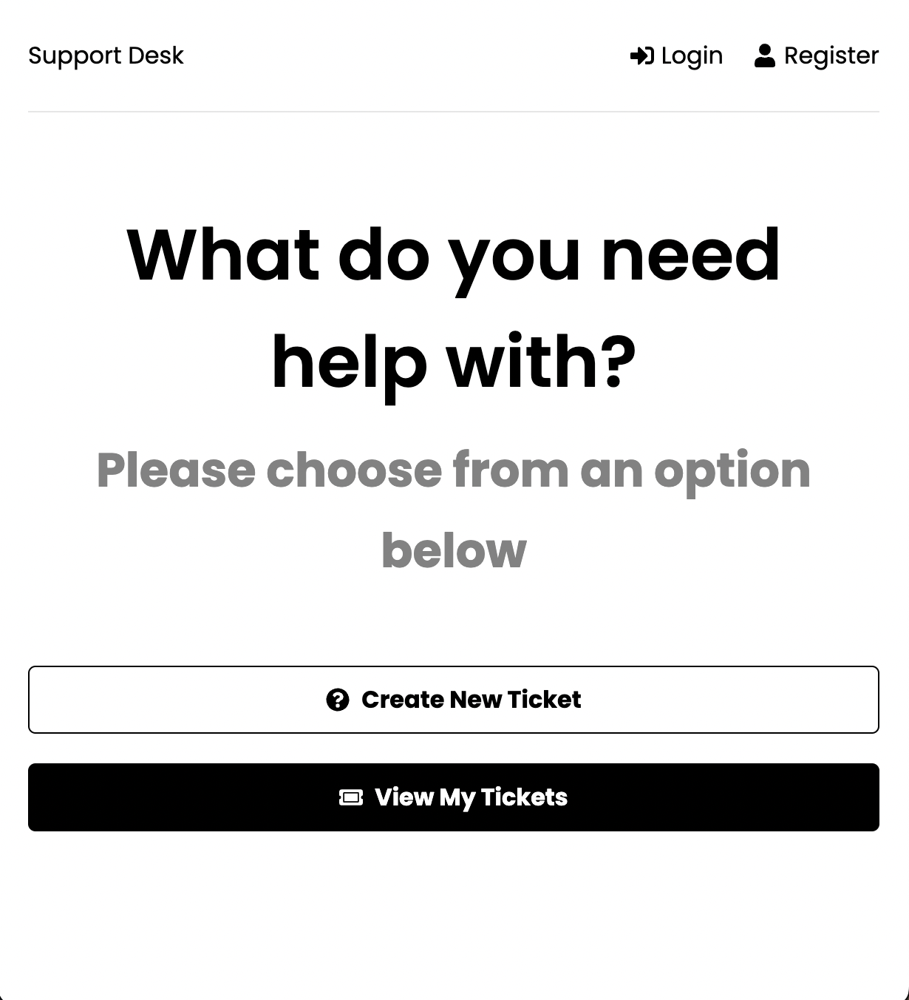
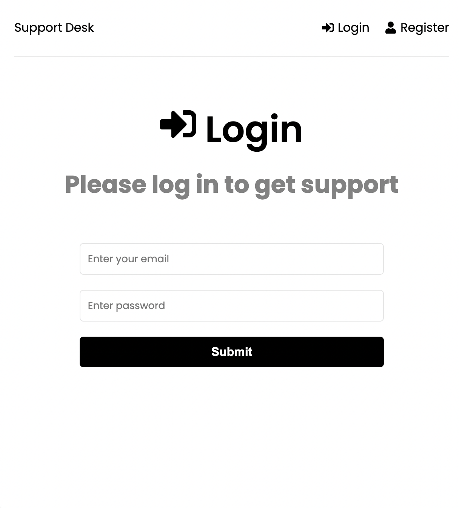
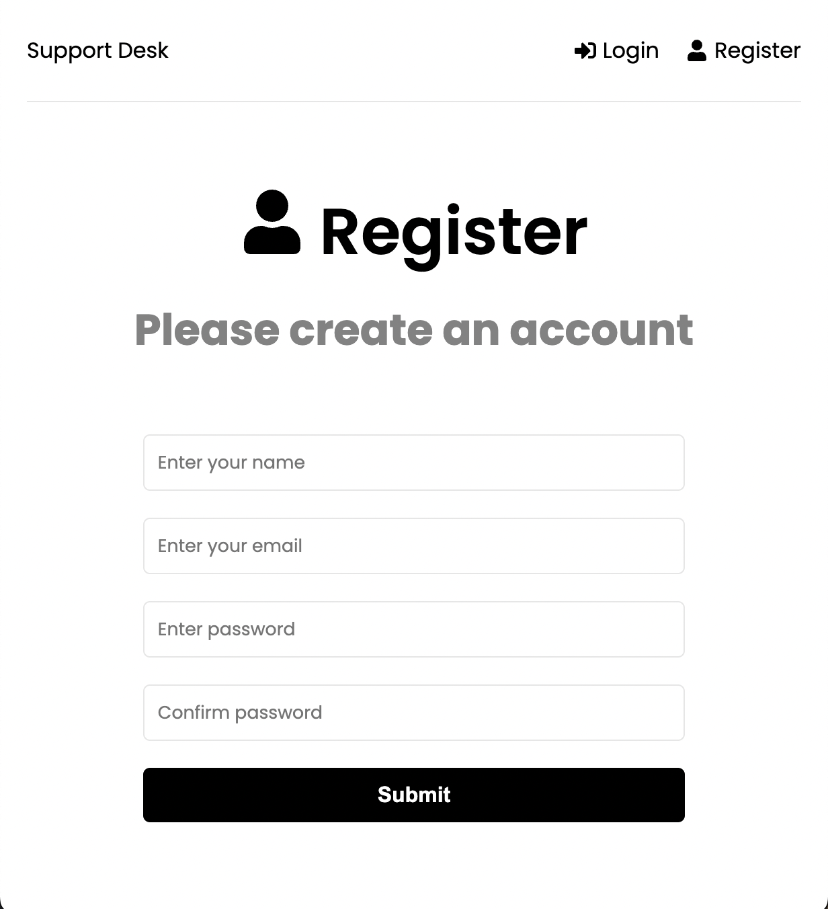
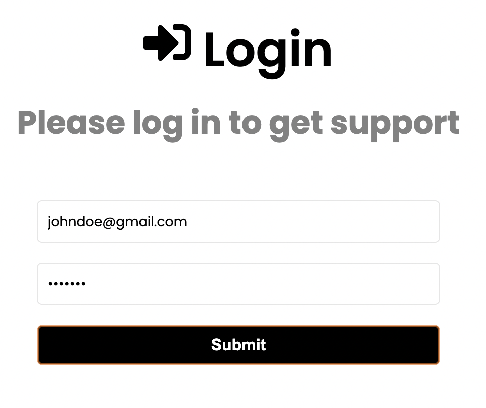
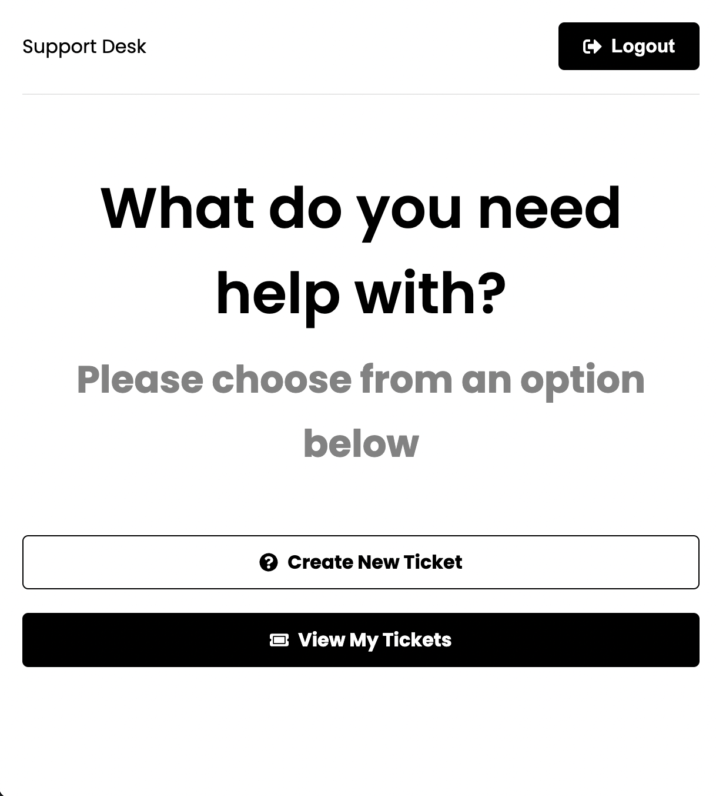
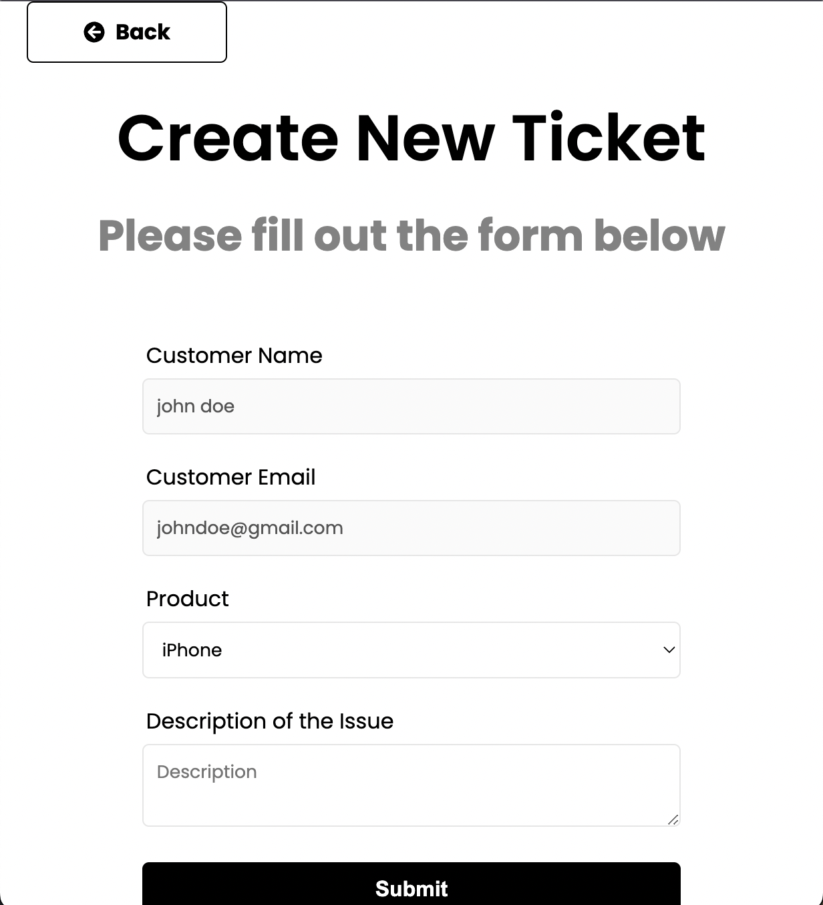
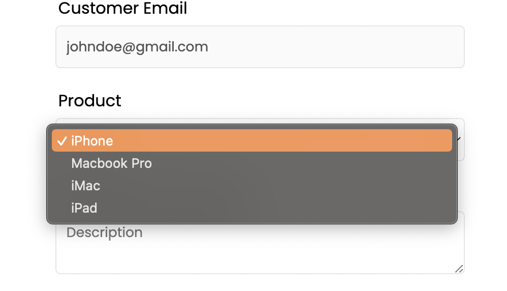
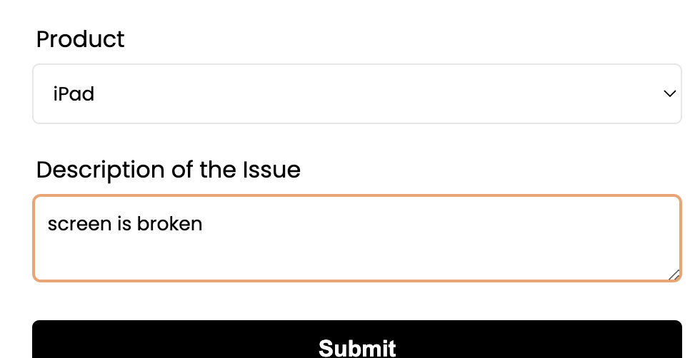
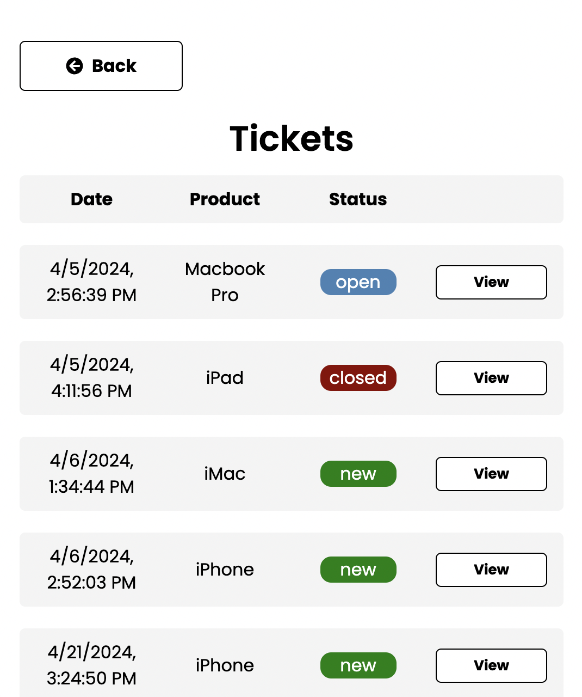
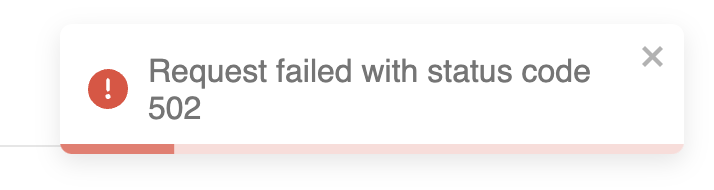

# Support Desk App

A support desk application for creating and managing tickets for tech support on Apple products.

## Table of contents

- [Overview](#overview)
  - [Built with](#built-with)
- [Usage](#usage)
  - [Main view](#main-view)
  - [Login and Register views](#login-and-register-views)
  - [Log in to view or create tickets](#log-in-to-view-or-create-tickets)
  - [Creating tickets](#creating-tickets)
  - [Viewing tickets](#viewing-tickets)
  - [Notifications](#notifications)
- [Issues](#issues)
- [Acknowledgments](#acknowledgments)

## Overview

This MERN full-stack app is a support desk website for users to create and manage tickets for tech support on certain Apple products such as iPhone, iMac, iPad, and Macbook Pro. Ticket information includes statuses of New, Open, and Closed. Administrative users can log in and view tickets and handle issues opened by users in need of tech support.

#### Built with

- React.js
- MongoDB for collections of users, tickets, and notes
- Express.js for managing servers and routes
- Node.js for runtime
- Redux for state management
- React Toastify for real-time notifications
- React Router 6 for page routing
- deployed to Render

## Usage

#### Main view

The main view of the app has a simple interface, asking the user what they need help with. A header navbar allows the user to Login or Register. Users may also select from two buttons to create a new ticket or view/manage existing tickets.

#### Login and Register views

The login view has inputs for the user to enter their email address and password to log in.

 

#### Log in to view or create tickets

From the main page, if the user is not logged in and either of the "Create New Ticket" or "View My Tickets" buttons is selected, the app will take the user to the Login page.

Once the user is logged in, the header navbar in the top right changes from "Login" or "Register", and becomes "Logout".

#### Creating tickets

Once logged in, the form to create a new ticket will automatically fill in the user's information for "Customer Name" and "Customer Email".

For the "Product", the user has a dropdown menu to select from a number of options for which type of product they need to open a ticket issue for.

Once a product is selected, the user may enter a description of the ticket issue in the textbox for "Description of the Issue". Once the "Submit" button is clicked, the ticket is added to that user's tickets.

#### Viewing tickets

Users with existing tickets to manage may "View My Tickets" and see a list of their tickets of technical issues, with data including the date and time the ticket was created, the type of product, the status of the ticket, and a button to View more details on each ticket.

#### Notifications

React Toastify is implemented to allow popup notifications with a timeout function to alert users to successes or failures of events.

## Issues

- [ ] The Render free tier deployment has run out, causing failure status code 502 when the user clicks "View" to see full details of an individual ticket
- [ ] Initial load for this app may take a number of minutes, due to Render free tier deployment

## Acknowledgments

Author: [Emily Knott](www.emilyknott.com)

This project was built as part of [Traversy Media](https://github.com/bradtraversy)'s comprehensive React course: [React Front to Back Course](https://www.traversymedia.com/Modern-React-Front-To-Back-Course)
